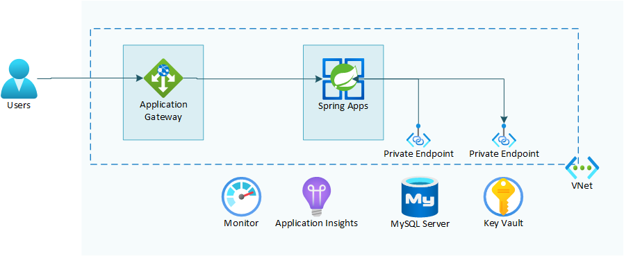

---
lab:
    Title: 'Challenge 08: Secure MySQL database and Key Vault using a Private Endpoint'
    Learn module: 'Learn module 8: Secure MySQL database and Key Vault using a Private Endpoint'
---

# Challenge 08: Secure MySQL database and Key Vault using a Private Endpoint

# Student manual

## Challenge scenario

You now have your Azure Spring Apps service deployed into a virtual network and the microservices connection requests from the internet must pass through your Application Gateway instance with Web Application Firewall enabled. However, the apps communicate with the backend services, such Azure Database for MySQL Flexible Server, Key Vault, Service Bus and Event Hub via their public endpoints. In this exercise, you will lock them down by implementing a configuration in which they only accept connections that originate from within your virtual network.

## Objectives

After you complete this challenge, you will be able to:

- Lock down the Azure Database for MySQL Flexible Server instance by redeploying it in a subnet
- Recreate the service connections to the new MySQL Flexible Server instance
- Lock down the Key Vault instance by using a private endpoint
- Test your setup

The below image illustrates the end state you will be building in this challenge.



## Challenge Duration

- **Estimated Time**: 60 minutes

## Instructions

During this challenge, you will:

- Lock down the Azure Database for MySQL Flexible Server instance by redeploying it in a subnet
- Recreate the service connections to the new MySQL Flexible Server instance
- Lock down the Key Vault instance by using a private endpoint
- Test your setup

   > **Note**: The instructions provided in this exercise assume that you successfully completed the previous exercise and are using the same lab environment, including your Git Bash session with the relevant environment variables already set.

   > **Note**: Since adding private endpoints to services is very similar across services, we will leave locking down the Service Bus and Event Hub namespace as an additional exercise for you, without adding the step by step instructions.

### Lock down the Azure Database for MySQL Flexible Server instance by redeploying it in a subnet

To start, you need to lock down access to your MySQL database by redeploying it inside a subnet. MySQL Flexible Server currently doesn't support private endpoint connections, this is why you'll need to deploy it inside of a subnet. You can use the following guidance to perform this task:

- [Private Network Access for Azure Database for MySQL - Flexible Server](https://learn.microsoft.com/azure/mysql/flexible-server/concepts-networking-vnet).
- [Create and manage virtual networks for Azure Database for MySQL Flexible Server using the Azure CLI](https://learn.microsoft.com/azure/mysql/flexible-server/how-to-manage-virtual-network-cli)

<details>
<summary>hint</summary>
<br/>

1. As a fist step, delete the current service connections of the `customers`, `visits` and `vets` apps to the current database server.

   ```bash
   CUSTOMERS_CONN=$(az spring connection list \
       --resource-group $RESOURCE_GROUP \
       --service $SPRING_APPS_SERVICE_VNET \
       --app $CUSTOMERS_SERVICE \
       --query [0].id \
       -o tsv)
   
   az spring connection delete \
       --id $CUSTOMERS_CONN
   
   VETS_CONN=$(az spring connection list \
       --resource-group $RESOURCE_GROUP \
       --service $SPRING_APPS_SERVICE_VNET \
       --app $VETS_SERVICE \
       --query [0].id \
       -o tsv)
   
   az spring connection delete \
       --id $VETS_CONN
   
   
   VISITS_CONN=$(az spring connection list \
       --resource-group $RESOURCE_GROUP \
       --service $SPRING_APPS_SERVICE_VNET \
       --app $VISITS_SERVICE \
       --query [0].id \
       -o tsv)
   
   az spring connection delete \
       --id $VISITS_CONN
   ```

1. Next delete the previous MySQL Flexible server instance you had.

   ```bash
   az mysql  flexible-server delete \
       --name $MYSQL_SERVER_NAME \
       --resource-group $RESOURCE_GROUP \
       --yes
   ```

1. Next create a private DNS zone for the new MySQL Flexible Server instance. You'll set the  DNS zone to `private.mysql.database.azure.com`. 

   ```bash
   MYSQL_DNS="private.mysql.database.azure.com"
   az network private-dns zone create -g $RESOURCE_GROUP -n $MYSQL_DNS
   ```

1. In the database subnet, recreate the MySQL Flexible Server and link it to the DNS zone. When you link the new server instance to the DNS zone, MySQL Flexible server will link your DNS Zone to your VNet and it will add an A record to the DNS zone for the name of your database.

   ```bash
   MYSQL_SERVER_NAME_VNET=mysql-vnet$APPNAME-$UNIQUEID
   az mysql flexible-server create \
           --name ${MYSQL_SERVER_NAME_VNET} \
           --resource-group ${RESOURCE_GROUP}  \
           --location $LOCATION \
           --admin-user myadmin \
           --admin-password ${MYSQL_ADMIN_PASSWORD} \
           --sku-name Standard_B1ms  \
           --tier Burstable \
           --version 5.7 \
           --storage-size 20 \
           --vnet $VIRTUAL_NETWORK_NAME \
           --subnet $DATABASE_SUBNET_NAME \
           --private-dns-zone $MYSQL_DNS
   ```

1. Also recreate the `petclinic` database.

   ```bash
   az mysql flexible-server db create \
       --server-name $MYSQL_SERVER_NAME_VNET \
       --resource-group $RESOURCE_GROUP \
       -d $DATABASE_NAME
   ```

</details>

### Recreate the service connections to the new MySQL Flexible Server instance

As a next step you will need to recreate each of the service connections of the `customers`, `visits` and `vets` services to the database. If you would try to do this from your git bash window, the creation of these will fail, since te statement needs to be executed from a prompt with network line of sight to your database server. For your current git bash prompt that is not the case. For executing these steps, you will be creating a jumpbox in the VNet and a bastion host for connecting to it. You can then execute the needed steps from the jump box. You can use the following guidance to perform this task:

- [Quickstart: Create a Linux virtual machine with the Azure CLI](https://learn.microsoft.com/azure/virtual-machines/linux/quick-create-cli)
- [az vm create](https://learn.microsoft.com/cli/azure/vm?view=azure-cli-latest#az-vm-create).
- [Deploy Bastion using Azure CLI](https://learn.microsoft.com/azure/bastion/create-host-cli)

<details>
<summary>hint</summary>
<br/>

1. As a first step create the subnet for the jump box VM.

   ```bash
   JUMPBOX_SUBNET_CIDR=10.1.5.0/24
   JUMPBOX_SUBNET_NAME=jumpbox-subnet
   az network vnet subnet create \
       --name $JUMPBOX_SUBNET_NAME \
       --resource-group $RESOURCE_GROUP \
       --vnet-name $VIRTUAL_NETWORK_NAME \
       --address-prefix $JUMPBOX_SUBNET_CIDR
   ```

1. Create the jump box virtual machine in this subnet. Make sure you replace the `<username>` and `<password>` replacement values in the below statements to use your own username and password.

   ```bash
   VM_NAME=jumpbox-$APPNAME-$UNIQUEID
   VM_ADMIN=<username>
   VM_PASS=<password>
   az vm create \
       --name $VM_NAME \
       --admin-username $VM_ADMIN \
       --admin-password $VM_PASS \
       --image Debian11 \
       --resource-group $RESOURCE_GROUP \
       --vnet-name $VIRTUAL_NETWORK_NAME \
       --subnet $JUMPBOX_SUBNET_NAME \
       --generate-ssh-keys \
       --output json \
       --verbose
   ```

1. Create the subnet for the bastion host.

   ```bash
   BASTION_SUBNET_CIDR=10.1.6.0/24
   BASTION_SUBNET_NAME=AzureBastionSubnet
   az network vnet subnet create \
       --name $BASTION_SUBNET_NAME \
       --resource-group $RESOURCE_GROUP \
       --vnet-name $VIRTUAL_NETWORK_NAME \
       --address-prefix $BASTION_SUBNET_CIDR
   ```

1. The bastion host will need a public IP address.

   ```bash
   BASTION_IP=bastion-ip-$APPNAME-$UNIQUEID
   az network public-ip create --resource-group $RESOURCE_GROUP --name $BASTION_IP --sku Standard
   ```

1. You can now create the bastion host

   ```bash
   BASTION=bastion-$APPNAME-$UNIQUEID
   az network bastion create \
      --name $BASTION \
      --public-ip-address $BASTION_IP \
      --resource-group $RESOURCE_GROUP \
      --vnet-name $VIRTUAL_NETWORK_NAME \
      --sku Standard \
      --enable-tunneling true
   ```

1. For connecting through the bastion host to your virtual machine, you will need the VM ID.

   ```bash
   VM_ID=$(az vm show --name $VM_NAME --resource-group $RESOURCE_GROUP --query id -o tsv)
   ```

1. From your git bash window you can now start an ssh session to the jump box VM through the bastion host.

   ```bash
   az network bastion ssh \
      -n $BASTION \
      -g $RESOURCE_GROUP \
      --auth-type ssh-key \
      --username $VM_ADMIN \
      --target-resource-id $VM_ID
   ```

1. The following steps you are executing on your VM jump box through the bastion hos ssh connection. As a first step, install the Azure CLI on the jump box VM.

   ```bash
   curl -sL https://aka.ms/InstallAzureCLIDeb | sudo bash
   ```

1. Once the Azure CLI is installed, log in to your Azure environment.

   ```bash
   az login
   ```

1. Executing the command will automatically open a web browser window prompting you to authenticate. Once prompted, sign in using the user account that has the Owner role in the target Azure subscription that you will use in this lab and close the web browser window.

1. Make sure that you are logged in to the right subscription for the consecutive commands.

   ```bash
   az account list -o table
   ```

1. If in the above statement you don't see the right account being indicated as your default one, change your environment to the right subscription with the following command, replacing the `<subscription-id>`.

   ```bash
   az account set --subscription <subscription-id>
   ```

1. Make sure the spring extension is available on the jump box VM as well.

   ```bash
   az extension add --upgrade --name spring
   ```

1. You will now need to recreate a whole bunch of environment variables, since these won't exist yet on your jump box VM. Make sure in the first statement you replace the `<your-unique-id>` replacement value with the unique ID currently being used by your resource group.

   ```bash
   UNIQUEID=<your-unique-id>
   APPNAME=petclinic
   RESOURCE_GROUP=rg-$APPNAME-$UNIQUEID
   SPRING_APPS_SERVICE_VNET=sa-vnet-$APPNAME-$UNIQUEID
   CUSTOMERS_SERVICE=customers-service
   VETS_SERVICE=vets-service
   VISITS_SERVICE=visits-service
   MYSQL_SERVER_NAME_VNET=mysql-vnet$APPNAME-$UNIQUEID
   DATABASE_NAME=petclinic
   DB_ADMIN_USER_ASSIGNED_IDENTITY_NAME=uid-dbadmin-$APPNAME-$UNIQUEID
   ADMIN_IDENTITY_RESOURCE_ID=$(az identity show \
    --name $DB_ADMIN_USER_ASSIGNED_IDENTITY_NAME \
    --resource-group $RESOURCE_GROUP \
    --query id \
    --output tsv)
   CUSTOMERS_SERVICE_CID=$(az identity show -g $RESOURCE_GROUP -n customers-svc-uid --query clientId -o tsv)
   VETS_SERVICE_CID=$(az identity show -g $RESOURCE_GROUP -n vets-svc-uid --query clientId -o tsv)
   VISITS_SERVICE_CID=$(az identity show -g $RESOURCE_GROUP -n visits-svc-uid --query clientId -o tsv)
   SUBID=$(az account show --query id -o tsv)
   ```

1. You can now (finally), start recreating the service connections.

   ```bash
   az spring connection create mysql-flexible \
       --resource-group $RESOURCE_GROUP \
       --service $SPRING_APPS_SERVICE_VNET \
       --app $CUSTOMERS_SERVICE \
       --target-resource-group $RESOURCE_GROUP \
       --server $MYSQL_SERVER_NAME_VNET \
       --database $DATABASE_NAME \
       --user-identity mysql-identity-id=$ADMIN_IDENTITY_RESOURCE_ID client-id=$CUSTOMERS_SERVICE_CID subs-id=$SUBID
   
   az spring connection create mysql-flexible \
       --resource-group $RESOURCE_GROUP \
       --service $SPRING_APPS_SERVICE_VNET \
       --app $VISITS_SERVICE \
       --target-resource-group $RESOURCE_GROUP \
       --server $MYSQL_SERVER_NAME_VNET \
       --database $DATABASE_NAME \
       --user-identity mysql-identity-id=$ADMIN_IDENTITY_RESOURCE_ID client-id=$VISITS_SERVICE_CID subs-id=$SUBID
   
   az spring connection create mysql-flexible \
       --resource-group $RESOURCE_GROUP \
       --service $SPRING_APPS_SERVICE_VNET \
       --app $VETS_SERVICE \
       --target-resource-group $RESOURCE_GROUP \
       --server $MYSQL_SERVER_NAME_VNET \
       --database $DATABASE_NAME \
       --user-identity mysql-identity-id=$ADMIN_IDENTITY_RESOURCE_ID client-id=$VETS_SERVICE_CID subs-id=$SUBID
   ```

1. You can now exit out of the bastion host ssh connection to the jump box VM.

   ```bash
   exit
   ```

1. In your regular git bash window, restart the spring apps that use the backend database to make sure they use of the new connection string info.

   ```bash
   az spring app restart \
       --name $CUSTOMERS_SERVICE \
       --resource-group $RESOURCE_GROUP \
       --service $SPRING_APPS_SERVICE_VNET \
       --no-wait
   
   az spring app restart \
       --name $VETS_SERVICE \
       --resource-group $RESOURCE_GROUP \
       --service $SPRING_APPS_SERVICE_VNET \
       --no-wait
   
   az spring app restart \
       --name $VISITS_SERVICE \
       --resource-group $RESOURCE_GROUP \
       --service $SPRING_APPS_SERVICE_VNET \
       --no-wait
   ```

1. You should be able to browse the spring petclinic app and see the data again.

1. In the Azure Portal navigate to your newly created MySQL Flexible Server and select the `Networking` menu. In the menu you will notice you can no longer lock down the server firewall. The server however only allows incoming calls through the virtual network.

</details>

### Lock down the Key Vault instance by using a private endpoint

Once you have locked down the internet access to the MySQL database, you will apply a private endpoint to the Key Vault to protect the Key Vault content. A private endpoint is represented by a private IP address within a virtual network. Once you enable it, you can block public access to your Key Vault. To accomplish this, you can use the following guidance:

- [Integrate Key Vault with Azure Private Link](https://docs.microsoft.com/azure/key-vault/general/private-link-service?tabs=cli).

<details>
<summary>hint</summary>
<br/>

1. To start, you need to disable private endpoint network policies in the subnet you will use to create the private endpoints.

   ```bash
   az network vnet subnet update \
      --name $PRIVATE_ENDPOINTS_SUBNET_NAME \
      --resource-group $RESOURCE_GROUP \
      --vnet-name $VIRTUAL_NETWORK_NAME \
      --disable-private-endpoint-network-policies true
   ```

1. Next you need to create a private endpoint for the Key Vault instance.

   ```bash
   KEYVAULT_RESOURCE_ID=$(az resource show -g ${RESOURCE_GROUP} -n ${KEYVAULT_NAME} --query "id" --resource-typ "Microsoft.KeyVault/vaults" -o tsv)

   az network private-endpoint create --resource-group $RESOURCE_GROUP \
       --vnet-name $VIRTUAL_NETWORK_NAME \
       --subnet $PRIVATE_ENDPOINTS_SUBNET_NAME \
       --name pe-openlab-keyvault \
       --private-connection-resource-id "$KEYVAULT_RESOURCE_ID" \
       --group-id vault \
       --connection-name openlab-keyvault-connection \
       --location $LOCATION
   ```

   > **Note**: Once you created the private endpoint, you will set up a private Azure DNS zone named `privatelink.vaultcore.azure.net` with an `A` DNS record matching the original DNS name with the suffix `vault.azure.net` but replacing that suffix with `privatelink.vaultcore.azure.net`. Your apps connecting to the Key Vault will not need to be updated, but instead they can continue using the existing endpoint info.

1. To implement this configuration, start by creating a new private DNS zone and linking it to your virtual network.

   ```bash
   az network private-dns zone create \
       --resource-group $RESOURCE_GROUP \
       --name "privatelink.vaultcore.azure.net"

   az network private-dns link vnet create \
       --resource-group $RESOURCE_GROUP \
       --zone-name "privatelink.vaultcore.azure.net" \
       --name MyVaultDNSLink \
       --virtual-network $VIRTUAL_NETWORK_NAME \
       --registration-enabled false
   ```

1. Next, create a new `A` record pointing to the IP address of the newly created private endpoint.

   ```bash
   KEYVAULT_NIC_ID=$(az network private-endpoint show --name pe-openlab-keyvault --resource-group $RESOURCE_GROUP --query 'networkInterfaces[0].id' -o tsv)
   KEYVAULT_NIC_IPADDRESS=$(az resource show --ids $KEYVAULT_NIC_ID --api-version 2019-04-01 -o json | jq -r '.properties.ipConfigurations[0].properties.privateIPAddress')

   az network private-dns record-set a add-record -g $RESOURCE_GROUP -z "privatelink.vaultcore.azure.net" -n $KEYVAULT_NAME -a $KEYVAULT_NIC_IPADDRESS
   az network private-dns record-set list -g $RESOURCE_GROUP -z "privatelink.vaultcore.azure.net"
   ```

1. You can now disable all public access towards your Key Vault.

   ```bash
   az keyvault update \
      --name $KEYVAULT_NAME \
      --resource-group $RESOURCE_GROUP \
      --public-network-access Disabled
   ```

</details>

### Test your setup

As the last step of this exercise and the lab, test your setup again. You should still be able to navigate to your application through the custom domain that you configured on your Application Gateway and view the listing of owners and veterinarians.

   > **Note**: In case you don't see any data when navigating the menu options in the application, try redeploying the customers, visits and vets apps again to Azure Spring Apps.

   > **Note**: If things don't work as expected, you can reconnect monitoring for your application and troubleshooting as described in the previous monitoring lab.

#### Review

In this lab, you implemented a configuration in which PaaS services used by Azure Spring Apps applications accept only connections that originate from within the virtual network hosting these apps.
